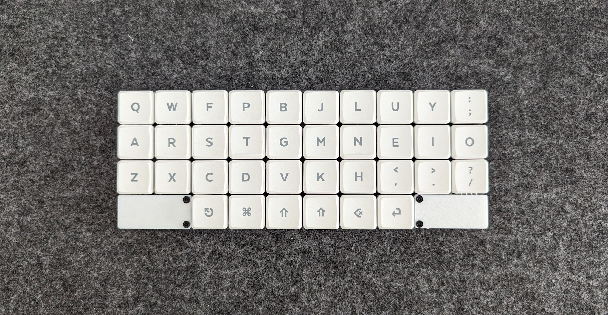

# 36 ortholinear split keyboard

## Keyboard Specifications:

* Type: Ortholinear Split Keyboard
* Key Layout: 3x5 keys + 3 thumb keys
* Switch Type: Choc v1 switches (Kailh 1350) or kailh x switches
* Wireless: Yes
* Controller: Seeeduino XIAO Ble

## Parts List

| Name                    | Count | Remarks            | Where to buy                                                              |
| ---                     | ---   | ---                | ---                                                                       |
| Choc v1 switches        |    36 | Kailh 1350         | https://aliexpress.ru/item/1005003211600725.html                          |
| Diode                   |    36 | SOD123             | https://aliexpress.ru/item/32354597825.html                               |
| Toggle Slide Switch     |     2 | SMD                | https://aliexpress.ru/item/32856542440.html                               |
| Spacer                  |     4 | Female Female M2x5 | https://aliexpress.ru/item/4001271908929.html?sku_id=10000015551405882    |
| Seeeduino XIAO Ble      |     2 |                    | https://aliexpress.ru/item/1005004459618789.html                          |
| Screw                   |     8 | M2x5               | https://aliexpress.ru/item/1005003116717551.html?sku_id=12000024187943658 |
| Choc Keycaps            |       |                    | https://keebd.com/products/mbk-legend-40s-set                             |
| Rubber Feet             |     4 |                    | https://aliexpress.ru/item/1005005249895853.html                          |
| 3.7v LiPo battery       |     2 |                    | Various models (601010, 501010, 401010, 400909) - 3.7v, 25mA-55mA         |

## Building Instructions

1. Solder the controller, diods and toggle switch on the top.
2. Then solder the switches over the diodes and attach the batteries.

